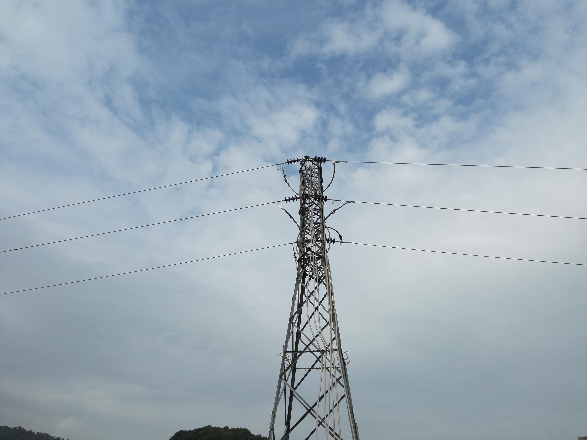
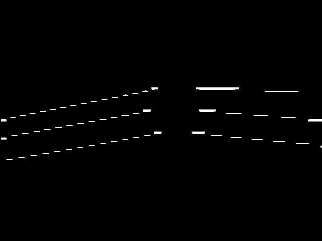

# ⚡ YOLOv9 Pole & Cable Segmentation

## Description
This project implements **YOLOv9** for **semantic segmentation of poles and cables** in images.  
It can detect and segment **utility poles, electrical cables, and similar structures**, which is useful for **infrastructure monitoring, maintenance, and inspection automation**.

## Tools
- Python  
- YOLOv9 (Ultralytics / Custom Implementation)  
- PyTorch  
- OpenCV & Matplotlib (visualization)  
